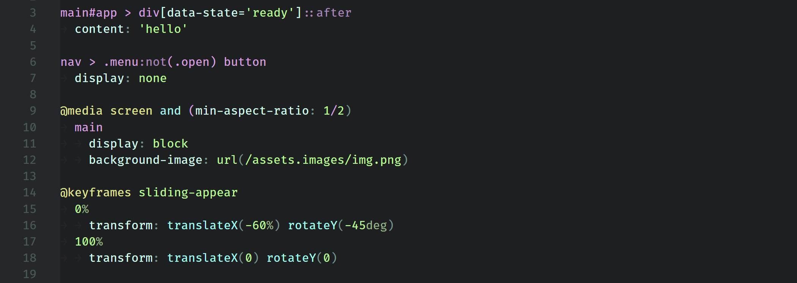

# Simple Focus Web

## VS Code relaxing theme using a limited color palette that is consistant, intuitive and easy on the eyes.

**Tested: JS/HTML/CSS/SASS/JSON**

Dark theme with relaxing colors, balancing vivid colors of values and functions with more faded ones for all the rest. It uses darker shades of the same colors to reduce the number of hues (the "noisy" christmas tree effect).

### Javascript, Javascript + HTML (lit-html)

### HTML

### CSS

### SASS

### JSON

### UI

