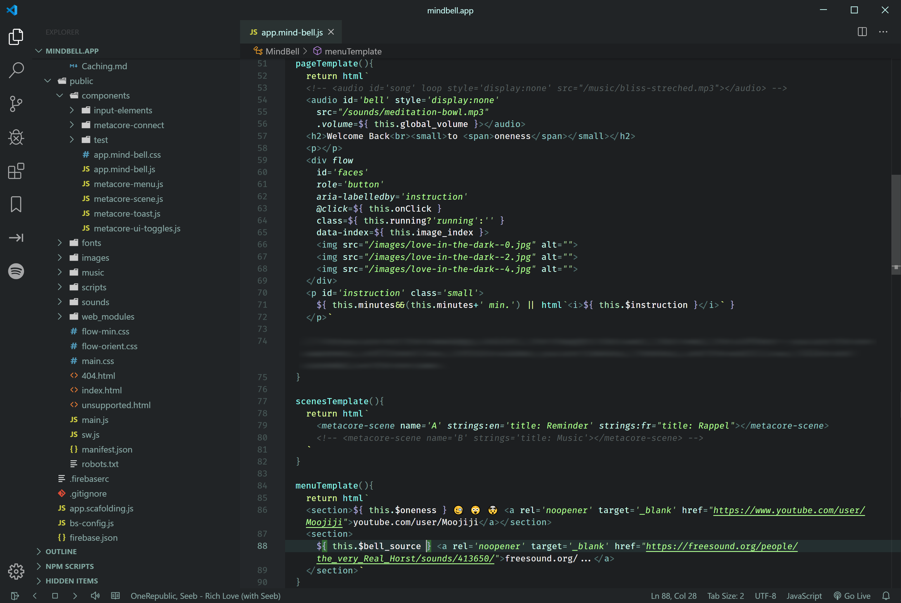
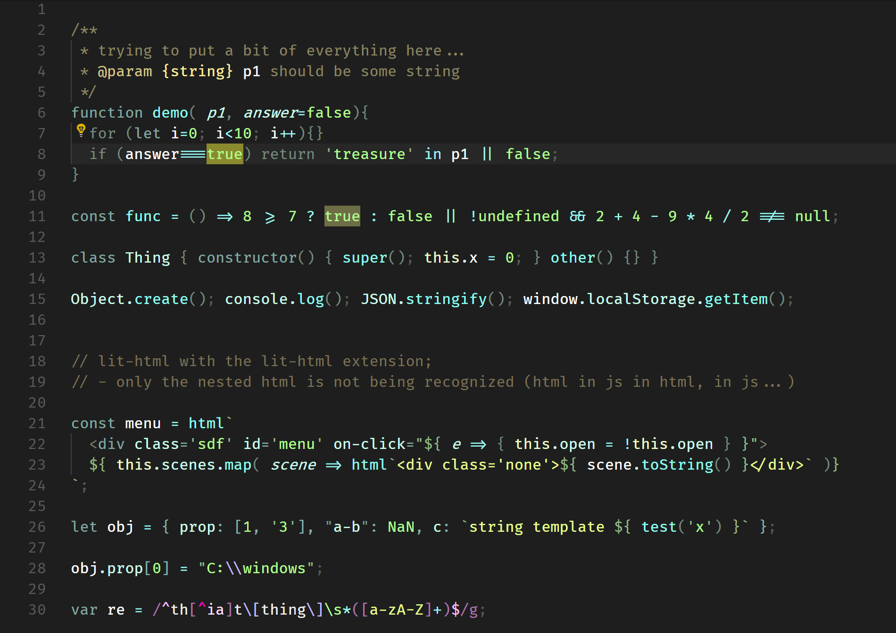
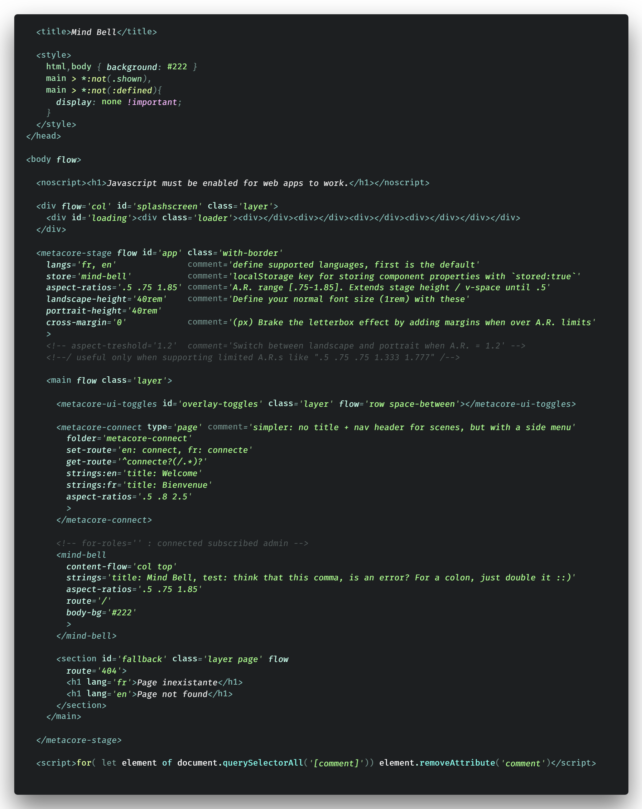
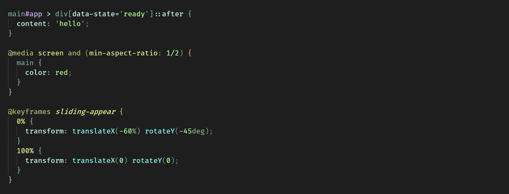
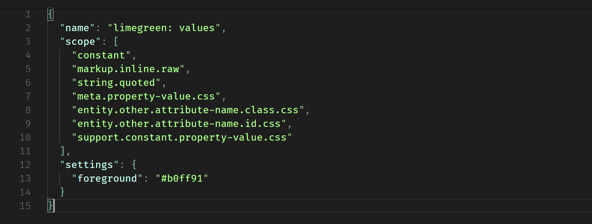

# Simple Focus Web

## A simple, unique color theme for VS Code. 

Made for elegance and functionality rather than "each thing its own color". Using a few bright colors to focus important parts of your code, reusing colors where it doesn't affect functionality. For example all values share the same brightest color so all values are absolutely contrasted to all the rest, more or less.

*Tested for JS / HTML / CSS / JSON / MD*

### UI / JS + HTML

### Javascript (+ HTML as a string template literal)

### HTML

### CSS

### JSON

