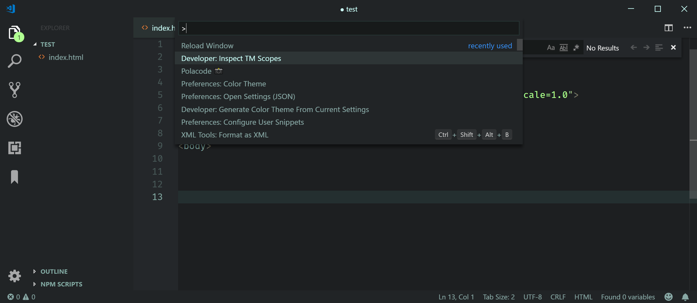

# Simple Focus Web

## VS Code relaxing theme using a limited, consistant color palette that is easy on the eyes.

**Tested with JS/HTML/CSS/SASS/JSON**

Dark theme with relaxing colors, using the same color to similar syntax elements, reducing color clutter/noise (higher cognitive load), making it (hopefully) easier and more intuitive to quickly find what you want.

### Javascript, Javascript + HTML (lit-html)

### HTML

### CSS

### SASS

### JSON

### UI

