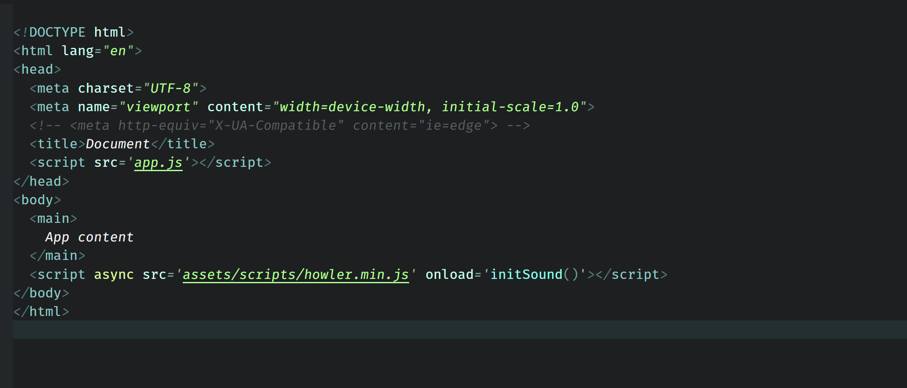

# Simple Focus Web

## VS Code theme built from scratch for web languages (JS/HTML/CSS) with a minimal color palette, focused on values.

Successor of the 'simple-focus' theme, with a more coherent and uniform color palette.

- All value types have the same vivid color;
- Colors for keywords / control characters / ponctuation etc. are more or less muted;
- Tweaked to work well with the lit-html extension.

### Javascript, Javascript + HTML (lit-html)

### HTML

### CSS

### JSON

